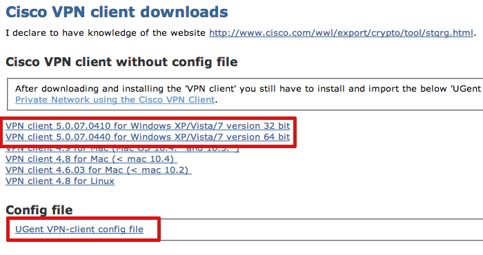
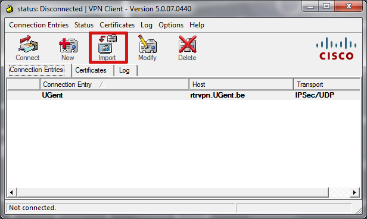
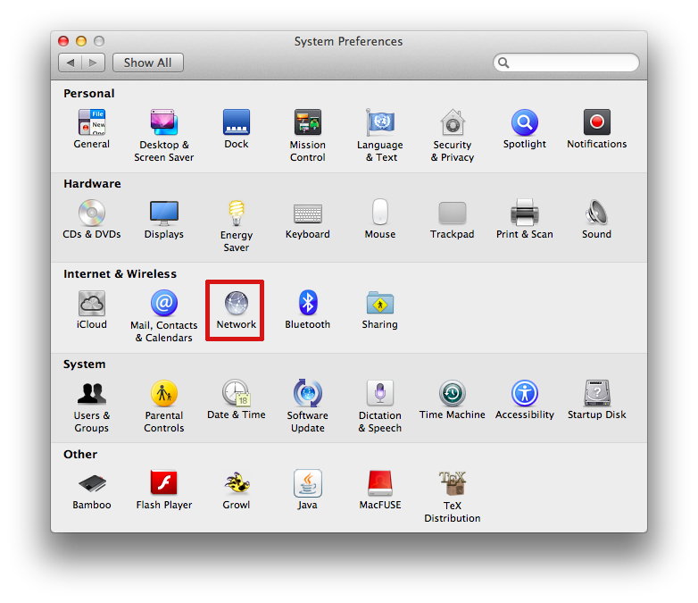
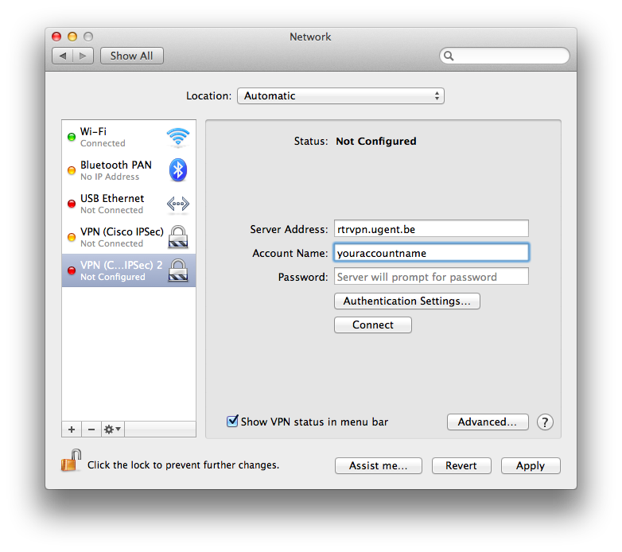
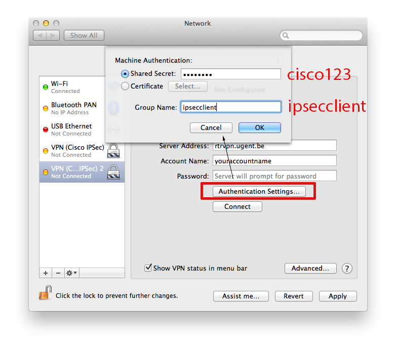

============================
安顿在根特
============================

这一节将介绍如何从国内机场到根特住址的过程，同时也会介绍一下来根特之后不免要做的几件事，包括办理手机卡、银行卡，向大使馆发信表明，办理比利时居留以及不可避免的到实验室见一下秘书和未来同事们（师兄师姐们）。

.. toctree::
   :maxdepth: 2
	
	flight

手机及手机卡
------------------
刚到比利时第一件事想必是给家里联系报平安。笔者推荐使用布鲁塞尔机场免费wifi通过即时通信软件完成。

到达根特后，对很多人来说第一件事是买手机卡。在这里笔者想提请大家注意的是，在国外留学打电话场合并不多。首先，与国内联系，无论家人或者同学，基本都是通过语音视频和即时通信软件如微信。其次，与根特的同学间的联系Whatsapp也是首选。最后与教授或者实验室同僚之间的联系是以邮件为主。

当然并不是说在根特就不需要手机了，我只是想强调真正需要打电话的场合远比在国内少。没有必要一下来就买一个流量多通话时间长的电话卡。

欧洲采用GSM制式，国内的非CDMA手机拿到比利时均可直接使用。比利时服务由多个运营商提供，通信质量和价格都有不小的差别，建议现行试用再做选择。此外同网通话一般有折扣，建议不妨选用相同的公司。留学生用的比较多的运营商包括

- \ Base_\
- \ Viking_\
- \ Proximus_\
- \ Telenet_\

.. _Base: http://www.base.be/
.. _Proximus: http://www.belgacom.be/en
.. _Viking: https://mobilevikings.be/en/
.. _Telenet: http://telenet.be/nl/gsm-abonnement/king

学校注册
----------------
报了平安并把行李扔到住处之后，首先要做的是去学校办理注册手续。

不管是硕士还是博士，第一站应该都是到光电实验室找秘书帮忙。光电实验室位于\ Technicum_\，Blok2的一楼。从Sint-Pietersnieuwstraat经过经过一片单车的停车场进门即可。注册的办理对于硕士来说几乎全部都是在\ `University Forum`_\（UFO），也就是Technicum旁边的大型玻璃建筑。而对博士来说，还有相当部分的手续是要在Directie Personeel en Organisatie（DPO）办理，DPO位于UFO北边一点的\ Rectoraat_\中一楼。

此外有可能大家还会需要找学院院长签字，院长办公室位于系楼\ `Plateau Building`_\中，进门之后可以按悬挂的指南寻找。

.. _Technicum: https://www.google.com/maps/place/Sint-Pietersnieuwstraat+41,+Site+Sint-Pietersnieuwstraat,+9000+Gent,+Belgium/@51.0460253,3.7269776,19z/data=!4m2!3m1!1s0x47c371500f8cce93:0x817cee8d48f63ab7
.. _University Forum: https://www.google.com/maps/place/Ufo+-+Vakgroep+Archeologie/@51.0467952,3.7277957,19z/data=!4m2!3m1!1s0x0:0x7c81dcc92e6fffdc
.. _Rectoraat: https://www.google.com/maps/@51.047173,3.7275114,19z
.. _Plateau Building: https://www.google.com/maps/place/Rozier+9,+Site+Sint-Pietersnieuwstraat,+9000+Gent,+Belgium/@51.0456351,3.7250331,18z/data=!3m1!5s0x47c3715a95ef2ae5:0xcdca1f8ea6af298c!4m2!3m1!1s0x47c3715a95e87c4b:0x9245b4f50ffb86d

UGentNet与VPN
--------------

顺利注册之后我们就可以用学校提供的UGentNet上网了，不过在上外网之前还有一点小工序要做，就是连接学校的VPN。此外如果住在学校宿舍通过网线上网是一定需要VPN的。

这里仅给出一个VPN使用简介。如果通过无线请确保连上了UGentNet，如果是在宿舍通过网线也请确认网线连到了数字最小的网口端。此时打开浏览器确认是否能连上\ 服务台_\。如果可以的话，在\ VPN_\页面可以找到软件和设置文件。安装软件并导入配置文件连接即可。

	
如果是使用苹果电脑的话，整个流程会相对简单不少。首先在系统设置下的网络设置中添加新的VPN，添加的时候选择Cisco VPN。之后按照下图所示的内容填入即可。值得一提的是，使用iOS的其他操作系统也可以按照同样的设置连接VPN。

	

除了使用UGentNet配合VPN之外，eduroam相对来说更加简单，直接连接eduroam账号为@ugent.be的邮箱，密码是邮箱密码即可连接。不过eduroam连接的时候需要安装证书，如果对此在使用上可以会有些问题，如果碰到不能连接的情况可以使用VPN或者找\ 服务台_\寻求帮助。
	
.. _服务台: http://helpdesk.ugent.be/en/
.. _VPN: http://helpdesk.ugent.be/vpn/en/akkoord.php

比利时居留
-----------------
在介绍如何办理居留之前，不妨先介绍一下什么是从短期居留（Temporary Residence Permit）到长期居留（Long-term Residence Permit）最后到公民（Citizenship）的整个过程。因为这个环节不可避免的要与当地人打交道，大部分名词的英文也会一并附上。

1. 当你抵达比利时之后，在学校办理完注册之后会收到一张注册证明（Certificate of Enrollment）后。可以在当地市政厅（Municipality）注册，表明你已经抵达比利时了。以在根特为例，可以在下面这个页面右边栏找到下载表格studentingent.be > choose English > requirements > your arrival in Ghent > registration at the city of Ghent > Arrival Form，填写好之后寄给市政厅即可。之后数周内会受到一封信表示市政厅已经收到你的申请了并给你一个有效期为45天的极短的居住文件。

2. 之后警察会到你的住址拜访你，询问和核实一些基本的个人信息。这就是俗称的“警察查房”。需要注意的是每个公寓在建造的时候可以居住人数是固定的，但是有些房东可能部分改建让更多人居住。这种房子是无法通过警察查房的。此外还有一点是，如果住在学校公寓警察查房这步是省略的。

3. 在查房之后市政厅会再跟你联系让你到指定地点办理A类居留卡（Type A Residence Permit），这张居留卡允许你在一定的时间内停留在比利时，一般有效期为一年。办理需要提供的证件在市政厅的邮件中会说明。

4. 在比利时连续居住五年后 [*]_ ，你就可以申请办理长期居留权（Long-term Residence Permit），如果市政厅批准之后，你可以获得D类居留卡（Type D Residence Permit）和一份纸质文件Appendix 7bis。纸质文件的有效期是无限的而居留卡的有效期是五年。因为纸质文件有效期无限，部分人也称状态为永久居留权（Permanent Residence Permit）。

根据上文的介绍，一般来说留学生间称之为居留卡或ID卡的就是A类居留卡（Type A Residence Permit）。这个居留卡有下面一些特点

- 此卡并不能作为身份证件使用，也就是说边境检查的时候需要同时出示护照和此卡
- 此卡的作用在于证明你有比利时短期居留权，也就是说此卡加上护照即可进入比利时境内而不需要签证了
- 比利时采用的是欧盟统一的带有公牛标志的标准卡，在部分机场转机的时候可以作为有效力的欧盟居留证件
- 此卡可以作为丢失护照情况下的身份证件之一，可以在布鲁塞尔大使馆补办护照

此卡对留学生来说是比较重要的，所以请在办理完入学手续之后抓紧办理。

.. [*] 一般的说法是，学生身份的五年并不计入在内，因为要求有一份稳定收入的工作。 

银行卡和银联
-----------------
比利时常见的银行包括但不限于

- \ ING_\
- \ `BNP Paribas fortis`_\
- \ Belfius_\
- \ KBC_\

.. _ING: https://www.ing.be
.. _BNP Paribas fortis: https://www.bnpparibasfortis.be
.. _Belfius: https://www.belfius.be
.. _KBC: https://www.kbc.be/

在这几家银行办理银行卡往往是不需要居留卡的，一般只需要提供护照和居住合同即可办理。银行卡服务分为Bancontact和Proton两种。前者是普通的借记卡服务，后者是电子钱包，刷的时候并不需要密码。Proton可以在银行的柜员机充值而且可以在根特大学的食堂使用。关于银行，可能你还需要知道下面几点

- 从国内往比利时汇款需要银行的SWIFT代码和个人账号账号IBAN，都可以在柜台索取
- 在欧元区刷欧元卡绝大多数银行都是不需要手续费的，反之在其他地方则可能要有不菲的手续费和换汇费
- 银联卡是可以在部分银行取钱的，比如BNP和BeoBank

