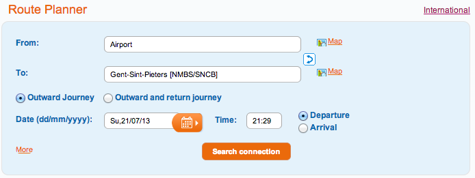
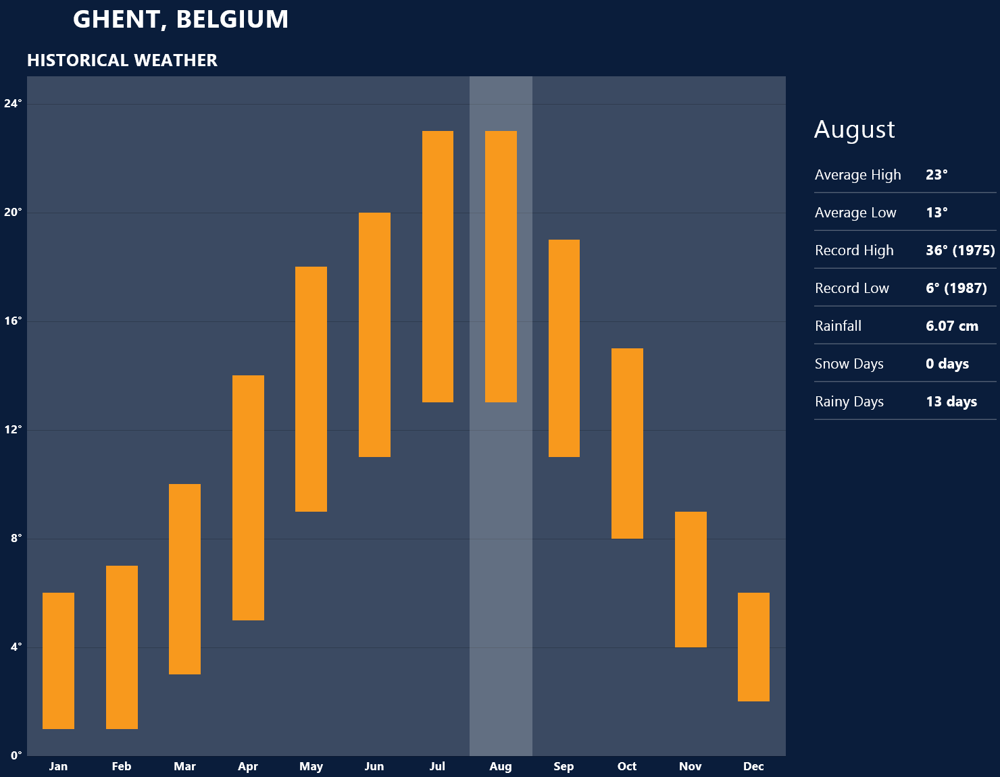

==============
行前须知
==============

收到了录取到登机离开，抱着对未知国家的憧憬和去国怀乡的惆怅，容易思潮澎湃，有时候容易对国外生活的小问题过度担忧。此外在网络与比利时相关的信息较为贫乏，查不到第一手的消息。念及于此，本章提供一些行前准备和比国生活相关信息，以作在国内解闷读物也让大家对比国生活有所了解。

住在根特
---------------
出门在外，找个住处是首要的任务。于是放在第一个介绍。

.. attention:: 在比利时持有Visa D的学生需要提供居住地址（Domicile）才可办理居留许可（Residence Permit）。在根特有少部分房子是不能提供Domicile的，这种房子请不要租住。后面章节会对此有进一步说明，也可以参考根特\ 居留相关网站_\

..  _居留相关网站: http://www.gent.be/eCache/STN/1/40/978.html

学校宿舍
~~~~~~~~~

根特因为近年国际学生持续增加，新建了一批\ 学校宿舍_\，其硬件条件在根特全体房源中质量中上，价格也较为公道，值得留意。根特学生宿舍提供给硕士的一般是studio而博士为apparement，但是因为申请时间较晚的原因也可能被分给Kamer，相关的价格信息和申请流程分别可以在\ 硕士_\和\ 博士_\找到。住在宿舍一来可以认识到很多同来的中国学生迅速融入当地生活，二来与国际学生住在一起可以很容易地认识许多新朋友增广视野，不失为一个好选择。

要想住在宿舍一般可以直接根据网上提供申请流程操作即可，遇到问题的时候请联系我们实验室秘书。

.. _学校宿舍: https://www.ugent.be/en/facilities/housing
.. _硕士: https://www.ugent.be/en/facilities/housing/degree.htm
.. _博士: https://www.ugent.be/en/facilities/housing/phd.htm

房源类型
~~~~~~~~~
在根特，房子一般分为下述四个类型

Kamer
  一栋楼中的一个单间，房间内可能带一个盥洗台，一般提供家具。除此之外厨房和厕所均是公用，一般会有三到四个人。Kamer是根特本科生和研究生最常见的居所之一。根特市内一个15平米左右的kamer价格应该在300欧左右，除非条件极好地理位置优越，一般不会超过350欧。

Studio
  一栋楼中的一个带厕所的单间，厨房是公用的。Studio是根特研究生与博士生常见的居所。价格一般在380欧上下，条件极好位置优越的studio一般也不会超过420欧。一般studio也会提供基本的家具。

Appartement
  厨卫齐全的公寓，相对Kamer与Studio而言价格较高，大部分博士生的选择。根据卧室的数量不同，价格变化很大。对于没有独立的卧室或者只有一个单独卧室的公寓，不含水电后一般房租从400欧到550欧不等而水电气每个月也需50欧左右。值得注意的是公寓一般是不提供家具的。

Woning
  独栋或者联排别墅，一般有二到五个Kamer而且含水电。因为往往位于郊区所以租金一般并不贵，较低的甚至可以再500欧左右。但是一来交通不便不适合大部分人其次水电，保险和管理费算入之后价格往往会出人意料地。此外woning基本需要购置全套家具，价格不菲。
  
租赁信息
~~~~~~~~~

在根特找到一个合心意的房子是需要一点时间，技巧和运气的。对Kamer至Single Apartment最为常见实用的租房方式是“扫街”，也就是说在你想租房的附近到处转转，因为房东会把租赁信息用鲜亮的黄纸贴在窗户上，看好了地方直接打电话联系看房，一般能够很快地掌握房屋第一手信息，也是笔者最为推荐的做法。考虑到本文读者身处国内，可以先找个临时住宿然后“扫街”。

此外，也可以利用互联网找房源联系好了过来之后马上签约。但是笔者并不十分推荐此做法，因为不亲眼确认一下房子的情况很有可能对会租到不满意的房子，此外大家对根特环境不熟悉也有可能住到离上班地方交通很不方便的地方，所以希望住房前慎重考虑。但是无论如何了解一下根特的房地产市场对租房是很有帮助的，下面给出了提供比利时部分房屋租赁信息的网站，值得注意的是，这些网站更新往往滞后，有时候会出现房子已经租出去了信息仍在网上的情况

- \ Zimmo_\
- \ Immoweb_\
- \ opkot_\

.. _Zimmo: http://www.zimmo.be/nl/
.. _Immoweb: http://www.immoweb.be/en/
.. _opkot: http://www.opkotingent.be/

除了在房屋检索引擎之外，直接在房地站中介公司的网站上查询也是个好办法

- \ Trans-immo_\
- \ `Axel Lenaerts`_\
- \ Immoboss_\
- \ Optima_\
- \ Rosseel_\
- \ Debaenst_\
- \ Arcade_\

.. _Trans-immo: http://www.trans-immo.be/
.. _Axel Lenaerts: http://www.axellenaerts.be/
.. _Immoboss: http://www.immoboss.be/
.. _Optima: http://www.optimaglobalestate.be/
.. _Rosseel: http://rosseel.be/
.. _Debaenst: http://www.vastgoeddebaenst.be/nl/
.. _Arcade: http://www.arcade-vastgoed.be/

行在根特
---------------
这节主要介绍在欧洲的交通通行方式，简单分为在根特内的交通，比利时内部的交通也稍微介绍一下比利时去邻近国家的交通。

根特交通
~~~~~~~~~

在根特而言，常见的交通方式无外乎公交和自行车了。

根特的公交系统比较发达，而且一般情况下是比较准时的，不失为在根特的主要交通方式。根特的公交公司是\ `De Lijn`_\，在\ 票务相关_\下提供最新的票价信息。值得留意的是公交的价格梯度是非常明显的，事前用购票机购票和上车购票相差1欧，而多次票和单词票的价格也比较悬殊，所以请先查看避免无谓的花销。此外对长期使用者建议购买月票，季票或者年票，根据年龄选择BuzzyPass或者OmniPass，可以无限次使用乘坐比利时境内DeLijn公交。

.. _De Lijn: http://www.delijn.be/index.htm
.. _票务相关: http://www.delijn.be/en/vervoerbewijzen/index.htm?init=true

自行车是最常用的交通工具，因为根特市范围很小，道路建设良好大部分都特意划分出来自行车专用道，骑行体验很好。不过在冬天的时候骑车就是冷暖自知了。在根特入手自行车一般有如下几个选择

二手自行车
  二手自行车往往是留学生的第一个选择。可以尝试从\ 根特人家_\，\ 鲁汶心情_\等华人社区网站发帖求购，也可以选择到根特的\ 二手商店_\以及常常开办的\ 二手市场_\淘宝

租自行车
  作为学生是可以从\ 租赁公司_\长期或者短期租用自行车的，这是一个专门为学生或者教职员工提供单车租赁的公司，价格低廉而且博士租车可以找系里面报销。唯一不好的是车况都不是特别好，如果一不小心租了一辆比较破的车可能三天两头都要推回去修车。
  
买新车
  欧洲新车一般比较贵，一辆很普通的车价格基本100欧起。根据经验买车一般去\ 迪卡侬_\能买到价格便宜质量不错的车。如果对骑行有兴趣，在市区的\ Plum_\能买到各大牌的山地车和公路车。
  
.. _根特人家: http://www.gente.be/
.. _鲁汶心情: http://www.luwenxinqing.com/
.. _二手商店: http://www.gent.be/eCache/STN/1/52/157.html
.. _二手市场: http://www.visitgent.be/en/markets
.. _租赁公司: http://www.studentenmobiliteit.be/
.. _迪卡侬: http://www.decathlon.be/
.. _Plum: www.plum-gent.com

  
比利时内交通
~~~~~~~~~~~~~

比利时内的交通最常见的选择就是火车。另一个不太常见的选项则是自驾。

首先介绍一下比铁。比利时全境内铁路网密集，只有数千人的小镇子也有铁路相连，发车频率高，此外因为网上可以查询时刻表而且发车到站时间在一般情况下都较准，乘坐起来十分方便。值得注意的是比利时火车站没有进站检票一说，检票一般是上车之后，所以在车站看见车了直接上就可以了，换乘也是如此，十分便利。

谈了这么多比利时铁路网的好，下面就介绍一下如何查询时间及购票。关于乘车和购票相关内容都可以在\ 比铁网站_\上进行。在下面的图中显示了如何从布鲁塞尔国际机场Airport到根特圣彼得车站Gent-Sint-Pieters的搜索，车站名后面方框里面的NMBS/SNCB表明了这是一个火车站，NMBS和SNCB分别是比利时国铁的荷兰语缩写和法语缩写。在这个网站中大家也可以按照路名或者地标搜索，是相当便利的。

	
对留学生来说，乘坐比铁一般购买“十次票”，即RailPass或者GoPass 10，分别针对一般乘客和26岁以下青年乘客，价格约为50欧和80欧。除去机场还需要另付一个特别费用，使用十次票可以随意坐比利时国铁的火车从一个城市到另一个城市，不计转车次数，相比起单独购票，是非常便宜的。

此外对于实验室的博士而言，如果你不住在根特而每天用火车往返实验室是给报销火车票的，因为这个政策，实验室可能有近三分之一并不住在根特而每日通勤。更加详细的信息可以在\ 比铁票务_\相关页面上查询。
	
.. _比铁网站: http://www.belgianrail.be/en/Dfault.aspx除非坐火车去机场还需要另付一个特别费用。
.. _比铁票务: http://www.belgianrail.be/en/travel-tickets.aspx

.. tip:: 对26岁以下学生来说除了有十次票也有\ 一次票_\。总而言之在大部分的时候比铁都有比普通单程/往返票更为合适的选择，提请大家事前多查询。

.. _一次票: http://www.belgianrail.be/en/travel-tickets/tickets/go-pass-1.aspx

除了火车之外，也可以选择自驾。一般而言，在比利时驾车并不是非常惬意的。在城市里面一般道路狭窄，停车位也很逼仄，很多较大一点的车都停不下，再考虑到根特和布鲁塞尔一带的堵车，选择自驾通勤的人并不多。

如果租车出游。在比利时内一般选择Carpool服务，主要由\ Cambio_\公司提供的。租车价格有计时和计公里（含汽油）两部分，租用一天需要二三十欧左右，每百公里也是二三十欧，所以三四个人在比利时境内租用两天往返两百公里大致需要一百多欧，算一下是比较划算的。

.. _Cambio: http://www.eurostop.be/

.. tip:: 国内驾照可以直接换取比利时驾照。需要提供驾照翻译件和原件在市政厅办理。需要注意的是此翻译员需获法院认可并加盖法院的章。换驾照唯一的限制是在来比前国内驾照已然生效。更多详细信息请到根特市政厅dienst rijbewijze(=Department of Driving)咨询。
                                                                                   

比利时与邻近国家
~~~~~~~~~~~~~~~~~~

比利时号称欧洲的心脏，所以去比利时邻近国家旅游是非常方便的。

火车一直是笔者最为喜欢的交通方式。从比利时出发有高速列车\ Thalys_\南接巴黎，北至阿姆斯特丹，东抵科隆。然后再转乘当地的高速列车如法国的TGV和德国的ICE，在六七个小时车程内可以覆盖半个德国和法国了。在滑雪季也会增开至法国阿尔卑斯山部分滑雪场的列车，非常方便。如果想去英国则要选择欧洲之星穿行海底隧道了。

如果购买铁路通票，火车价格是非常有竞争力适合欧洲漫游的。作为留学生可以购买的\ InterRail_\，则除了大部分高速列车需要补交预定费之外，绝大部分其他列车都是涵盖在内的，配合可以查询具体哪些车次需要预定可以的\ RailDude_\和可以查询火车时刻的德铁网站\ DeutschBahn_\，相信诸位在欧洲旅游漫游会非常舒适。

除了火车漫游之外，欧洲的廉价航空也是非常发达的。知名的如\ Ryanair_\ ，\ EasyJet_\或者较不知名的\ Wizz_\或者\ WOW_\都提供非常有竞争力的机票。笔者相信大部分读者都非常熟悉各种搜索便宜机票的网站例如\ momondo_\和\ Skyscanner_\，需要提请注意的是有些廉价航空的票价与官网不符合甚至搜不到航班，有必要的时候需要根据此\ 廉价航空公司列表_\在航空公司网站上搜索。

.. _Thalys: https://www.thalys.com/be/en/
.. _InterRail: http://www.interrail.eu/
.. _RailDude: http://www.raildude.com/cn/interrail-%E8%AE%A2%E5%BA%A7-%E4%B8%8E-%E5%B7%AE%E4%BB%B7%E8%B4%B9
.. _DeutschBahn: http://www.bahn.de/p_en/view/index.shtml
.. _Ryanair: http://www.ryanair.com/en/
.. _EasyJet: http://www.easyjet.com/en/
.. _Wizz: http://wizzair.com
.. _WOW: http://wowair.com/
.. _momondo: http://www.momondo.com/
.. _Skyscanner: http://www.skyscanner.net
.. _廉价航空公司列表: http://en.wikipedia.org/wiki/List_of_low-cost_airlines

食在根特
------------------
不管是向往欧洲美食的老饕，还是想自己动手丰衣足食的学生，吃饭总归是一等一的大事，在此节将分别介绍一下根特饮食，比利时啤酒和巧克力，最后也会介绍一下留学生自己做饭的花销等。

米其林评级和TripAdvisor
~~~~~~~~~~~~~~~~~~~~~~~~~
大家在国内可能常听见几星级餐厅这个说法，在欧洲的话，如果这不是一种乱用，那么在国外多半指\ 米其林餐厅评级_\。米其林虽然是个法国轮胎生产商，但是在十九世纪末，他们为了提高汽车的销量从而提高轮胎的需求，他们出版了这个手册。虽然有不少在日本和香港的餐厅也获得评级，米其林只要针对的是欧洲菜，笔者认为在可以当作一个在欧洲生活的美食指南用。虽然米其林提供了许多信息，但是唯一反应食物美味水平的只有下面会提到的两种。

.. sidebar:: Amazingly Good! Amazingly Expensive!
   
	.. image:: michelin1.jpeg
		:width: 180px

.. topic:: Michelin Star
	
	米其林星级餐厅。分为一到三星。一星表示此餐厅在当地非常优秀；二星表示餐厅极度优秀，值得绕路前往；三星表示此餐厅极其优异，值得专门前往。在笔者看来，除了这表意不明的三句话而言，他们的价格非常好的表明了他们的身价。一般在一星级餐厅吃一个全餐（Full Course）大概需要70欧，二星级则一般需要140欧，而三星级一般在230欧左右。所以笔者建议如果有可能的话可以去品尝米其林星级餐厅提供的工作日午餐特价，一星级如果不含酒水可能在25欧左右而二星级大概50欧，是值得尝试的。

.. sidebar:: 对我们有用的指南!
   
	.. image:: michelin2.jpeg
		:width: 180px

.. topic:: Bib Gourmand
	
	米其林推荐餐厅。相比星级餐厅价格亲民了很多，属于咬咬牙也能够选择的餐厅。选择餐厅的时候请留意米其林有时候会给出一个刀叉标签，提请注意的是这个小标签并不代表食物的美味程度而是代表这个餐厅用餐环境如何，所以如果不是商务宴请我笔者觉得可以直接忽略。
   
.. _米其林餐厅评级: hhttp://www.viamichelin.com/

除了米其林评级之外，国外当然也有类似大众点评的\ Tripadvisor_\和\ Yelp_\。与大众点评一样里面的评论鱼龙混杂需要多加以辨别。就笔者经验往往TripAdvisor推荐有一定的信服力但是具体的评价就不需要太过分关注了。正如大家看游记照着攻略去餐厅吃饭有时候并不如直接撞进路边一个餐厅味道来的好。

.. _Yelp: http://www.yelp.com/
.. _Tripadvisor: http://www.tripadvisor.com/

根特饮食
~~~~~~~~~~~~~~~~~~
读者有兴趣可以先读一下维基的\ _比利时餐饮\。总体而言，比利时的饮食受到法国菜影响很大，对菜的调味掌握相比德国和英国更加出色，而且就如法国菜特别擅长凉菜一样，比利时的凉菜做得也是比较出彩，到比利时后不妨到处品尝一下。由于笔者能力所限，仅稍微介绍一下根特特色菜，根据笔者经验，一般提到根特饮食，大抵离不开下面几个
	
spare ribs
	烤排骨，选用猪肋骨腌制后烤制而成。因为其价格低廉（多为自助）而且味道与国内口味有些接近，常为留学生外出聚餐的选择。如无特指，根特排骨这个词指\ Amadeus_\，有可能也会指其他店如\ `De Gekroonde Hoofden`_\	
	
Mosselen-friet	
	酒烧海虹陪薯条。除了酒烧之外还有蒸这个做法。经常被称为是比利时的国菜。
	
gentse stoverij
	根特啤酒炖肉。最为常见的是炖牛肉，特点是炖的过程中要加入比利时特有的啤酒。吃的时候会感受到一阵浓郁的酒香。

gentse waterzooi
	根特蔬菜奶肉炖肉。有鱼肉和鸡肉两种版本。
	
Vol-au-vent
	严格来说这个名字指一种法国空心小点心，里面放馅料，但是在根特都是放入炖鸡肉。
		
.. _比利时餐饮: http://en.wikipedia.org/wiki/Belgian_cuisine
.. _Amadeus: http://amadeus-resto.be/?lang=en
.. _De Gekroonde Hoofden: http://www.degekroondehoofden.be/

啤酒巧克力
~~~~~~~~~~~~~~~~~
比利时啤酒是世界知名的。在此我想特别介绍一下修道院啤酒（Trappist Beer）。修道院啤酒顾名思义即由修士酿造的啤酒，在啤酒的领域中名气很大，评价也很高。统共十个品牌的修道院啤酒中比利时总共占六家，事实上三家仅仅仅仅在近一两年才加入，所以基本可以说修道院啤酒就是比利时特产，来到比利时是一定要多多品尝的。这六家比利时啤酒分别是

- \ Rochefort_\
- \ Westmalle_\
- \ Westvleteren_\
- \ Chimay_\
- \ Orvay_\
- \ Achel_\

除了最知名的修道院啤酒之外，比利时酿酒作坊遍布全境，有各种各样口味的啤酒，比如香蕉啤酒，芒果啤酒，藜麦啤酒等等，如果有兴趣的可以多尝试一下。

除了啤酒之外，比利时夹心巧克力（Belgian Praline）也是非常有名的。自从1912年在比利时被发明之后，比利时一直以出产顶级巧克力而自豪[#]_。我相信不用我介绍大家可能已经听过Godiva，Neuhaus和Leonidas等品牌，但是我在这更想介绍Neuhaus巧克力工厂店和独立巧克力店。

\ Neuhaus巧克力工厂店_\以可以随便试吃闻名，店内所有巧克力盒子都是打开的，可以随便拿随便吃。除了Neuhaus限量工艺或者特别的巧克力基本在店里都能找到试吃，实在是巧克力爱好者的第一站。而且在店内购买价格也十分低廉，如果有兴趣不妨采购一些回国赠送亲友。

但是比利时巧克力世界闻名还有手工巧克力。手工巧克力一般指是由糕点师（pâtissier ）或是巧克力师（Chocolatier）手工制作而成的巧克力。一般均有独立的店铺，比如\ `Planet Chocolate`_\，\ Sasaki_\等。值得一提的是\ `Le Saint-Aulaye`_\的Ryan Stevenson和\ `La Dacquoise`_\的Dmitiri Salmon，这两人都曾经代表比利时参加世界巧克力大师赛决赛（World Chocolate Masters Finals）如果有机会不妨去尝试一下。

.. _Rochefort: http://en.wikipedia.org/wiki/Rochefort_Brewery
.. _Westmalle: http://en.wikipedia.org/wiki/Westmalle_Brewery
.. _Westvleteren: http://en.wikipedia.org/wiki/Westvleteren_Brewery
.. _Chimay: http://en.wikipedia.org/wiki/Chimay_Brewery
.. _Orvay: http://en.wikipedia.org/wiki/Orval_Brewery
.. _Achel: http://en.wikipedia.org/wiki/Achel_Brewery

.. _Neuhaus巧克力工厂店: https://www.google.com/maps/preview?ie=UTF-8&fb=1&cid=9843689833181837381&q=Neuhaus+Vlezenbeek&ei=q4nwU4P7CqnM0QWL0YGYAQ&ved=0CJ8BEPwSMAs

.. _Planet Chocolate: http://www.planetechocolat.be/
.. _Sasaki: http://www.patisserie-sasaki.be/ 
.. _Le Saint-Aulaye: http://saintaulaye.be/
.. _La Dacquoise: http://www.la-dacquoise.be/

.. [#] 虽然坊间一直批评比利时巧克力水平下降，因为代表世界巧克力最高水平的世界巧克力大师赛比利时仅在2005年获得优胜 

中餐
~~~~~~~~~~~~~~~~~~~~

抵御根特寒潮
-------------
带什么衣服是出国前都会碰到的问题，对在比利时常驻的人来说最简单的答案当然就是都带上如果不够再买。但是如果仅过来交换一年半年的，选择带的衣物就有一定的意义了。所以在此节将介绍一下比利时的天气让大家考虑携带的衣物，同时也会谈到当地留学生是如何购买衣服的。

比利时属于比较典型的海洋性气候，如下图所示，四季温度变化并不剧烈，冬天最冷一般也不会低于零下五六度，所以冬天下雪并不多见，雨夹雪反而稀松平常。切莫太过高兴，因为根特冬季相对潮湿，虽然温度不低，体感温度也着实够冷的。在夏天气温不高，最热的时候一般三十度刚出头，而且晚上基本都是二十度左右，所以可以说根特一年中有三百天是适合穿长袖的，穿短袖的时间很短。所以如果对携带衣物有取舍的话，建议多带长袖。

除了气候温和之外，海洋性气候的降水量也很充沛，简单来说就是淅淅沥沥的小雨经常下个没完，在这个时候如果有件防水防风的风衣是比较惬意的。冬天雨夹雪的时候如果套件防风保暖的大衣也是比较重要的。

在国内习惯了网购的各位到了根特可能会相当不适应，因为网购在欧洲并不方便。这或许是由于下面两个原因，相比于淘宝，eBay非常不给力，价格并不十分有竞争力不说邮费一跨国（德国法国那也是国际快递）邮资往往会让人觉得很无奈。相比于美国每个品牌发达的直销，特别是官网提供的折扣，在欧洲的品牌网站上往往都是正价，很少见打折一说。因此网购的价格优势基本为零，反而因为不能亲自试穿有时候会带来更多的问题。

当地留学生一般会选择每年两度（大概七月和一月）的打折季在市区的购物街选购，或者到遍布欧洲的“工厂店” Factory Outlet选购。与比利时靠近Roermond打折村是欧洲最大的打折村之一，可以选择参加学联组织的活动或者自行前往，在购物村徜徉一日基本上便可满足购物所需了。

我还想带这个！
------------------
除了基本的衣食住行之外，现代生活总有各种各样的需求，不过网上盛传的各种出国行李清单往往容易把人吓坏，让人感慨那并不是留学而是搬家。其实一般来说国内能买到的东西国外都能买到，可能价格上稍有区别但是很少见国内很便宜国外贵得发指的物品，所以大可不必什么都带过来。下面会提到一些常见的要带的物品，并稍加介绍。

电子消费品
~~~~~~~~~~~~~~~~~~
常说留学生三大消费电子是电脑，相机，手机。借着出国良机，想把自己手里的东西全部都裁汰了是人之常情，笔者也一向认为如果这些电子产品会给生活带来许多便捷，如果有富裕何不更换。不过关于手机我想提醒一下大家，在根特手机并不如国内那么重要。

在国内手机是消磨交通时间，上课时间，睡前时间的神器，而且与人联系的十分方便。不过在欧洲并不完全如此，首先根特是个小城市，每日通勤时间很短，并没有太多交通时间要消磨；上课的时候可以直接拿个电脑出来，比手机好玩多了；至于联系的话，与国内的小伙伴的联系基本是靠微信和QQ，与国外的小伙伴泰半是WhatsApp和Facebook，与不太熟悉如教授一般都是邮件。可以说打电话通话的需求并不高。当然我并不是让大家不要买手机，只是想提醒一下与国内的区别。

此外想要提醒博士生的是，光电实验室会给博士配发笔记本电脑或者台式机，配置相对来说也是比较高端的机型，所以如果不是喜欢双电脑工作，并不需要在国内换新电脑。

药品
~~~~~~~~~~~~~~~~~~
出门带药一般有三个原因，一是不懂怎么形容自己身上的症状，二是担心看病太贵，三是担心国外的药“吃不惯”。

笔者对带药持较负面态度。最关键的一点是作为没有接收过医疗培训的人，自己给自己“诊疗”很难做到对症下药，有可能忽视大病征兆而带来更负面的影响。笔者一向认为身体不适应该看病。

此外，如果出国之后如果连得病之后都不懂怎么形容未免让人觉得可能有些太弱了。关于费用，因为比利时贯彻社会医疗保障制度，基本上看病开销并不高，普通门诊几欧即可，药品的价格也并不是很贵。至于药品“吃不惯”的问题，事实上大家稍微查一下就发现我们在国内开的药绝大部分都是西药，此外笔者认为过分强调东西方人不同也未免有因噎废食之感。

小生活用品
~~~~~~~~~~~~~~~~~~

开学前准备
-----------------
在这一章将主要介绍一些在实验室常用的软件，可能更多的针对于博士生，未必需要在国内花时间掌握，但是希望至少有个概念，等用到的时候可以再阅读更加有针对性的内容。

Python
~~~~~~~~~~~~~~~~~

MATLAB 
~~~~~~~~~~~~~~~~~

LaTeX
~~~~~~~~~~~~~~~~~