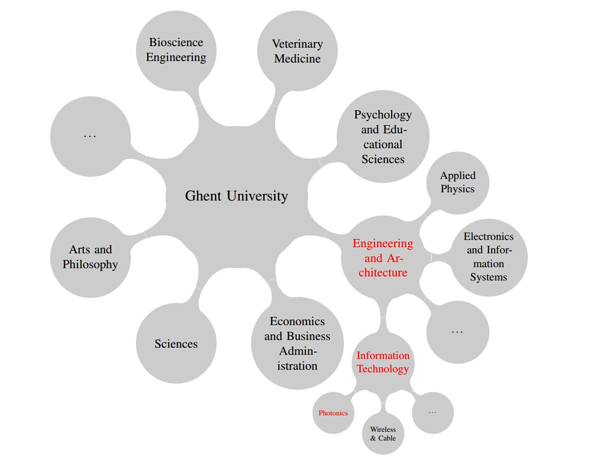

============================
比利时，根特以及实验室简介
============================
   
比利时
---------------------------

比利时王国地处西欧，因其毗邻德法荷，同时与英国隔海相望，常被称为欧洲的心脏，也正因为这个原因，首都布鲁塞尔是欧盟总部的所在地。比利时在欧洲属于人口稠密的国家，国土面积约三万平方公里，人口约一千一百万。现任国王为菲利普（Philippe of Belgium）。比利时也常与荷兰及卢森堡共称为荷比卢，在英语上这三国也常被称为low countries。气候上比利时属海洋性气候，因此四级温润多雨，非常宜居。

因为地理上比利时同时与荷兰，法国和德国三个大国接壤，同时由于一些 `历史原因 <http://en.wikipedia.org/wiki/History_of_Belgium/>`_ ，比利时分为三个语言区。北部弗兰德大区使用荷兰语 而南部瓦隆大区使用法语。除此之外，瓦隆大区东部有极小的德语区。较为特殊的是布鲁塞尔首都区，是一个双语区。比利时所用的荷兰语与荷兰的稍有区别，所以有时候也被称为Flemish。因为荷兰语被使用的范围相对窄，国内接触不多，我在此也稍微介绍一二。

荷兰语常被称为是介乎于英语和德语之间的语言，荷兰语的词汇与德语词汇相当接近，词性上原先也有着阴、阳、中性的划分，后来逐渐简化阴性阳性的划分已经逐渐模糊，所以人们常说荷兰语只有common gender和neuter两种词性。语法成分和语序上荷兰语与德语也非常近似，因为有时候人们说荷兰语是德语的一种方言。考虑到荷兰语应用范围狭小，有时候人们会建议只学德语自然而然就可以掌握荷兰语，但是毕竟与德语有着不同的 `起源 <http://en.wikipedia.org/wiki/Dutch_language#Diachronic>`_ ，此外荷兰语也吸收了很多法语成分甚至英语，所以就学习而言是有着巨大区别的。

值得高兴的是，虽然荷兰语是官方语言，在荷语区的人英语水平普遍比较高，日常对话基本没有障碍，所以来比之前并不需要掌握荷兰语。当然，学点当地语言对融入当地生活是很有好处的。

根特(Gent)
-----------

根特市位于弗兰德区的东弗兰德省同时也是省会。据 `统计 <http://en.wikipedia.org/wiki/Ghent/>`_ 根特人口约为24万，现为比利时第三大城市 [#]_ 。因为其中有相当一部分是学生，根特也是一个大学城。根特通用语言是荷兰语。根特距离布鲁塞尔仅约四十公里，乘坐火车从布鲁塞尔南站出发只需约30分钟就可抵达根特圣彼得火车站。

历史上根特也曾显赫一时，十三世纪时候，根特是仅次于巴黎的欧洲最大最繁荣的城市之一。今天仍然矗立在根特市中心的 `钟楼 <http://en.wikipedia.org/wiki/Belfry_of_Ghent>`_ 和 `圣尼古拉斯教堂 <http://en.wikipedia.org/wiki/Saint_Nicholas'_Church,_Ghent>`_ 就是根特兴盛时期的建筑遗留。根特曾经的繁荣主要源于羊毛纺织业，由于地处斯海尔德河和利斯河交汇处，根特形成独特的多草而又潮湿的地域，很适合放牧绵羊。后由于 `哈纲雷战役 <http://en.wikipedia.org/wiki/Battle_of_Gavere>`_ ，低地国家的中心也从布鲁日－根特为代表城市的弗兰德转移到安特卫普－布鲁塞尔为代表城市的 `布拉班特公爵 <http://en.wikipedia.org/wiki/Duchy_of_Brabant>`_ 领地。16世纪末到 17世纪，根特因为是加尔文宗的城市而卷入宗教战争，被西班牙帝国给予毁灭性打击，并改奉天主教，从此根特失去了国际化商业中心的地位。

.. [#] 前两名是布鲁塞尔与安特卫普

根特大学(UGent)
----------------

根特大学于 1817 年由当时的荷皇威廉一世建立。在 1830 年比利时战胜荷兰获得独立后根特大学由比利时政府管理，现在是比利时最负盛名的大学之一。全校共有 11 个院超过 130 个系。下面给出了光电实验室在根特大学的隶属关系。光电实验室从属于信息工程系，而信息工程系是工程与建筑系下的一部分。注意图中并不包括所有的院系或实验室。

光电实验室(PRG)
---------------

根特的光电实验室（Photonics Research Group, PRG）实验室主要研究方向集中在硅基光电器件的研发和 III-V-on-Si。硅基光电器件包括各类调制器，解调器，波导，谐振腔等。III-V-on-Si 技术大概来说是利用某种粘结剂把三五族晶片粘结在硅片上，实现了有源和无源器件的集成。此外，组里也与位于鲁汶的IMEC（Interuniversity MicroElectronics Centre） 紧密联系积极开发新的制程工艺，据编者所知包括氮化硅和锗平台的开发。因为教授较多，研究方向也非常多，所以在下面给出每个教授研究方向的简介，希望对大家有所帮助。此内容由实验室 `王瑞军 <http://photonics.intec.ugent.be/contact/people.asp?ID=344>`_ 提供，在此表示由衷的感谢。

根特光电实验室主要由七名教授与约七十名博士生及博士后组成，其中中国博后三名博士九名，在九月份开学的时候相信数字还会进一步增加，属于根特大学中国人最多的实验室之一。此外还有相当数量的技术和行政支持人员。

在下面的卡片中给出了实验室各个教授的研究方向。此内容由王瑞军提供，在此表示由衷的感谢。

	
.. sidebar:: Big Boss!
   
	.. image:: roel.jpg
		:width: 120px

.. topic:: Roel Baets

   Roel算是硅基光电领域世界数一数二的人物，各种的头衔和论文数量与引用记录可以在其 `个人页面 <http://photonics.intec.ugent.be/contact/people.asp?ID=1>`_ 上查阅。他是Photonics Research Group的创始人，二十几年的时间把光电所带到如今的规模和成绩。目前硅基光电所有领域都有所涉及，课题组的教授们除了Nicolas以外都是他的学生。目前重点方向有基于氮化硅的近可见的波段器件，生物光电子和硅基光电子的光源。尤其是硅基光电子在生物和医学领域的应用是目前的一个重要兴趣点，而氮化硅平台目前还在跟IMEC合作建立中。平时非常忙，参加各种会议和学术活动，但是每个月基本都有跟学生讨论的机会，学生主要跟Gunther Roelkens合带，所以许多学生的具体指导由Gunther来做。
   
   
   
.. sidebar:: Math, Math and Math!
   
	.. image:: biensman.jpg
		:width: 120px

.. topic:: Pieter Biensman

   Peter是课题组模拟平台的建立人，在跟Roel Baets读博士期间主要工作是建立光电器件分析的模型和软件平台，也是课题组还经常在用的软件CAMFR的原型，完成根特的博士工作后前往MIT著名的Joannopoulos课题组从事了一年多的博士后工作，由于Joannopoulos那段时间刚刚完成了重要的开源微纳光学模拟软件MEEP，所以Peter Bienstman将MEEP进行了Python化。目前在工作有基于他建模经验的硅基光学信息处理的计算，如Neuromorphic Computing。另外主要工作在生物硅基光电子学，例如基于简单无源软件的生物传感器等。截止目前为止，中国学生很少（甚至可以说没有，国际学生也很少）
   
.. sidebar:: No drinks in the lab!
   
	.. image:: nicolas.jpg
		:width: 120px

.. topic:: Nicolas Le Thomas

   Nicolas是我们课题组教授中唯一没有在根特获得博士学位的人，在法国获得博士学位后前往瑞士的EPFL就行了将近十年的研究工作，从2012开始在课题组担任教职。他之前的工作是就是微纳光学的设计表征和应用，例如光子晶体在生物传感器方面的应用，目前的工作也是延续这方面来开展，同时他也积极其他生物传感的课题，大老板的Raman课题的他经常负责具体的指导工作已经相关测量平台的建立。由于刚刚在2012拿到教职，所以目前开展的研究方向和学生不多，与每个学生讨论的时间很多，是个很负责任的绅士。Nicolas在实验室主要负责测量室，对光路设计和各种精密探测理解非常深，有什么测量上的疑难都可以找他。
   
.. sidebar:: Luceda is born!
   
	.. image:: wim.jpg
		:width: 120px

.. topic:: Wim Bogaerts

   Wim是课题组和IMEC基于CMOS线的硅基光电加工平台的主要建立人，基本上他所有的工作就是围绕着这个平台的建立和完善，他的一个主要的合作伙伴是Pieter Dumon。目前在欧洲利用CMOS工艺来加工硅基光电器件主要有三个地方—比利时的IMEC，法国的LETI以及德国的IHP，我们课题组主要利用IMEC平台来加工器件的无源部分（目前也开始接受部分有源部分加工），而完善这个平台就是Wim过去十几年的工作。所以他的博士后和博士的工作一个就是利用这个平台设计一些相对复杂的光电器件，例如modulator和AWG，还有就是完善这个平台和解决这个平台的一些工艺问题。所以基本上他的学生接触工艺部分很少，主要是器件的设计（Mask Design）和后续的测量。Wim平常喜欢开玩笑耍宝，而且在不久之前Wim的新公司 `Luceda <http://www.lucedaphotonics.com/>`_ 开张了，学生的自主时间很多。

.. sidebar:: Lasers are Cool!
   
	.. image:: geert.jpg
		:width: 120px

.. topic:: Geert Morthier

   Geert是Roel最早的博士生之一，也是课题组最早开展有源器件研究的教授，在分布式反馈激光器（DFB Laser）方面做过很多工作。由于Geert博士毕业后很长段时间在工业界（IMEC）从事有源器件的工作，所以激光器自始至终都是他工作的聚焦点。目前几个学生基本都在做DFB Laser和microdisk lasers的工作，这部分工作的学生也与Dries来联合指导，另外一个工作是大连理工的物理与光电工程学院的赵明山老师在这边所做的聚合物光电器件工作，目前还有项目基金和博士后在做。值得一提的是Geert有非常丰富的关于高速测量的经验，所以实验室测量间关于High Speed一块主要是由他负责的。
   
.. sidebar:: Mid-IR is Awsome!
   
	.. image:: gunther.jpg
		:width: 120px

.. topic:: Gunther Roelkens

   Gunther 是我们组目前最年轻的教授，也曾是根特大学最年轻的教授之一，算是硅基光电世界上年轻辈学者里面的佼佼者。他的博士工作主要包括两方面，一个基于380nm厚硅层SOI的Grating Coupler设计，另外一方面就是InP有源器件与SOI的BCB键合，两方面工作都很出色。与Roel一样，目前硅基光电的所有领域都有所涉及，从无源器件的Grating Coupler，有源的激光器和探测器等等，目前也在开始进行硅基光电系统的设计。目前的Roel的大部分学生Gunther都有联合指导。Gunther的工作重心目前有两块，一块是III-V有源器件在硅基上的集成，这部分我们的主要方式是利用一种叫BCB的聚合物来键合，通俗来说就是用一种超薄的胶水来将III-V材料粘到硅基上面去。另外一个是中红外硅基光电子学的研究，这个工作最初由Richard Soref在2010年Nature Photonics提出来，然后Gunther在那一年申请到欧盟的一个大项目ERC Starting Grant来开展了这个领域很多原创工作，包括中红外有源器件的集成，硅基非线性光学和中红外量子点器件。
   
.. sidebar:: Photonics is versatile!
   
	.. image:: dries.jpg
		:width: 120px
		
.. topic:: Dries Van Thourhout

   Dries是我们课题组另外一位研究方向很广的教授，他是Gunther博士期间的联合导师，所以研究方向和风格与Roel和Gunther很类似，既有从事硅基有源器件的集成，量子点的硅基集成还有利用硅基平台进行Photonic力学系统的研究。他是咱们组最早开展硅基有源集成的教授，有源的集成器件需要开展大量的超净间工艺，所以他也是咱们组超净间部分的负责人。有源集成部分Dries也有与IMEC合作开展直接在SOI上外延生长III-V然后加工器件，根特这边主要负责器件的设计和生长之后后续的加工与表征，这部分工作与课题组大部分人利用的键合集成方式有所不同。
   
   Dries的研究中有很fancy的idea，例如有几个博士一直在开展的Silicon optomechanics的研究，这方面的研究在science和Nature子期刊发了几篇不错的顶级论文。}Coupler，有源的激光器和探测器等等，目前也在开始进行硅基光电系统的设计。目前的Roel的大部分学生Gunther都有联合指导。Gunther的工作重心目前有两块，一块是III-V有源器件在硅基上的集成，这部分我们的主要方式是利用一种叫BCB的聚合物来键合，通俗来说就是用一种超薄的胶水来将III-V材料粘到硅基上面去。另外一个是中红外硅基光电子学的研究，这个工作最初由Richard Soref在2010年Nature Photonics提出来，然后Gunther在那一年申请到欧盟的一个大项目ERC Starting Grant来开展了这个领域很多原创工作，包括中红外有源器件的集成，硅基非线性光学和中红外量子点器件。 