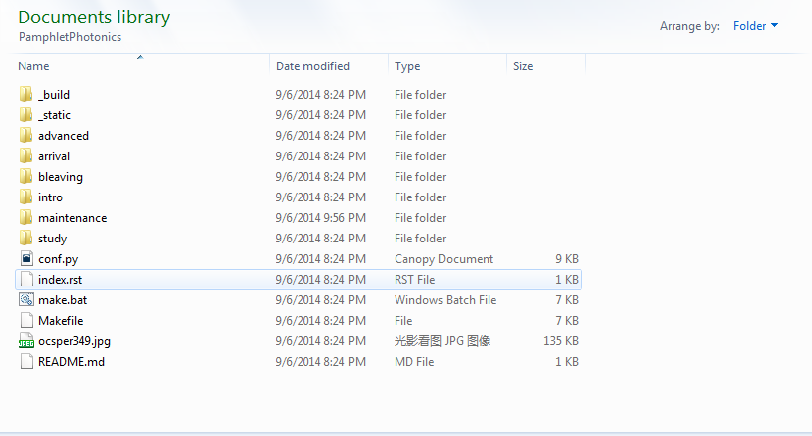

============================
关于
============================

光电手册是一个开放项目并遵守Creative Common 4.0的BY-SA协议。BY表明使用者在复制、发行、展览、表演、放映、广播或通过信息网络传播本作品的时候必须按照作者或者许可人指定的方式对作品进行署名。本手册的署名方式为给出github或者readthedocs的链接。SA表明如果使用者对手册进行了修改需要根据相同的协议发布。

.. image:: ccbysa.png
    :width: 88px
	:align: center
	
技术层面上，手册编写基于\ reStructuredText_\语言，HTML页面则由\ Sphinx_\产生。手册的原始内容寄放于\ GitHub_\而生成的HTML寄放在\ `Read the Docs`_\。

.. _reStructuredText: http://docutils.sourceforge.net/rst.html
.. _Sphinx: http://sphinx-doc.org/
.. _Github: https://github.com/
.. _Read the Docs: https://readthedocs.org/

想参与编辑手册可以直接将想要添加或者修改的内容发到我邮箱（milkcarbon@gmail.com）。如果想要对手册进行大修或者对手册编写过程有一定的兴趣，也可以采用与笔者相同的办法

1. 首先下载enthought Canopy的\ academic_\版本。你需要用学校的邮箱注册，比如@ugent.be。下载之后安装会弹出一个package manager，在package manager里面搜索sphinx并安装。

2. 注册一个github账号，登入之后打开手册的\ 页面_\并点中右上角的fork。

3. 下载github的\ 客户端_\，登入之后在界面左上角的加号点开，在clone分栏下找到PamphletPhotonics，会弹出一个窗口让你选择存放的路径。

.. image:: ccbysa.png
    :width: 500px

4. 打开路径之后应该看到类似的一个文件夹，需要注意的是index.rst和conf.py两个文件，分别对应手册的主页和主要配置文件，如果对sphinx不太懂的话可以暂时只关注前者。文件夹中以下划线开头的可以暂时忽略，剩下的文件夹分别对应每一章的内容。
	

	
5. 用一个文本编辑软件打开后缀为.rst的文件编辑即可，推荐\ `Notepad++`_\，如果对.txt、.doc和.rtf格式之间的区别不太了解的话，请不要选择Word或者写字板等软件。

6. 编辑好之后打开cmd [+]_ ，利用cd把当前文件夹改到手册存放路径，输入make html。如果没有错误提示，在文件夹下_build中就能找到新编辑好的软件。需要注意的是本地编辑使用默认python文档的模版，与网页版是不同的。

7. 如果觉得编辑的好，可以参考\ github帮助_\发出邀请把修改的内容添加进手册中。

.. _academic: https://store.enthought.com/#canopy-academic	
.. _页面: https://github.com/haolan/PamphletPhotonics
.. _客户端: https://windows.github.com/
.. _notepad++: http://notepad-plus-plus.org/
.. _github帮助: https://help.github.com/articles/using-pull-requests

.. [+] Win7在开始菜单键入cmd，如果是win8按control + Q输入cmd