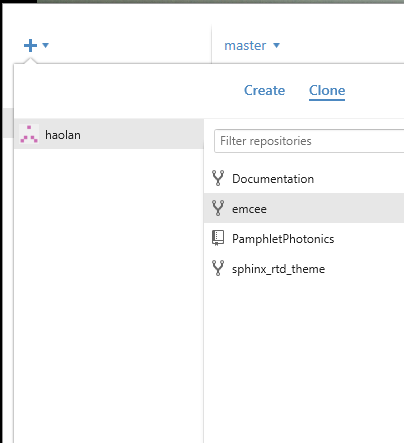

============================
关于
============================

:Author: Haolan Zhao
:Status: Incomplete

.. sidebar:: Creative Commons!

	.. image:: ccbysa.png
		:width: 200px

.. topic:: 使用声明

   光电手册是一个开放项目并遵守Creative Common 4.0的BY-SA协议。BY表明使用者在复制、发行、展览、表演、放映、广播或通过信息网络传播本作品的时候必须按照作者或者许可人指定的方式对作品进行署名。本手册的署名方式为给出github或者readthedocs的链接。SA表明如果使用者对手册进行了修改需要根据相同的协议发布。


技术层面上，手册编写基于\ reStructuredText_\语言，HTML页面则由\ Sphinx_\产生。手册的原始内容寄放于\ GitHub_\而采用的主题和HTML寄存均通过\ `Read the Docs`_\实现。

.. _reStructuredText: http://docutils.sourceforge.net/rst.html
.. _Sphinx: http://sphinx-doc.org/
.. _Github: https://github.com/
.. _Read the Docs: https://readthedocs.org/


想参与编辑手册可以直接将内容发到我邮箱（milkcarbon@gmail.com）。


考虑到可能会想要对手册进行彻底的重新编辑，或者想仿此手册编写类似材料的读者，在此也会给出一些更加具体的介绍。更多详尽内容请善用Google检索。

reStructuredText
``````````````````

reStructuredText简称reST，与LaTeX和HTML类似，同样作为非所见即所得系列的一种标记语言。标记语言，顾名思义通过标记来改变文字的属性。比如

.. code-block:: json

	 *emphasis*
	 **emphasis**
	 .. image:: images/ball1.gif

会分别给出

*emphasis*

**emphasis**

.. image:: ball1.gif

相比起常用的Word，这类标记语言的一个缺点是学习曲线很陡，为了实现某个特定的功能往往需要查手册才能确定。哪怕一个较为熟练的用户往往也只是掌握了其中部分代码。但是与复杂度相匹配的是其强大的功能，良好的多平台适用性以及丰富的资源包。我相信大部分LaTeX用户都会有这样的感觉。

Github
``````````

Github简单来说是一个公共的程序分享网站。与Sourceforge和GoogleCode类似，程序员可以把自己的程序上传到上面并由大家合作进一步完善。简单的工作模式是这样的，原作者首先编写出一个程序的初版，上传到github上便称为这个程序的主分支（Master），然后每个用户都可以复制一份此程序并自己加以修改，这个复制的过程称为fork，而你编辑的软件则称为branch。如果某个用户觉得自己的添加的功能非常酷炫，可以向原作者发出分至合并的申请（Pull Request），如果原作者也认同此观点，则那个branch就被融合进master了。

虽然Github主要针对程序员，但是因为其较为良好的历史编辑追溯功能和强大的分享功能，现在也有不少人在Github上分享各类资源，较为有趣的包括菜谱，群体日记等。当然大家都可以有自己的利用方式。具体Github的使用方法网上非常多，可以自行检索。

Sphinx
````````````````
Shpinx是一个文档生成软件，开发的初衷是给程序员迅速撰写Python软件包的说明文档，最主要的功能是将reST文档转换成HTML页面。Sphinx是作为一个Python的附件包提供的，安装Sphinx推荐采用 :doc:`../study/python` 中述及的Python安装方式。安装成功之后再自行添加Sphinx。

Readthedocs
````````````````
Readthedocs(RTD)是一个


采用reST编写的着眼点主要在于其适用性。不仅可以像现在一样可以把内容挂载在Readthedocs，也可以利用生成的HTML自建网页，或者配置sphinx的LaTeX插件生成标准pdf文档。

1. 首先下载enthought Canopy的\ academic_\版本。你需要用学校的邮箱注册，比如@ugent.be。下载之后安装会弹出一个package manager，在package manager里面搜索sphinx并安装。

2. 注册一个github账号，登入之后打开手册的\ 页面_\并点中右上角的fork。

3. 下载github的\ 客户端_\，登入之后在界面左上角的加号点开，在clone分栏下找到PamphletPhotonics，会弹出一个窗口让你选择存放的路径。




4. 打开路径之后应该看到类似的一个文件夹，需要注意的是index.rst和conf.py两个文件，分别对应手册的主页和主要配置文件，如果对sphinx不太懂的话可以暂时只关注前者。文件夹中以下划线开头的可以暂时忽略，剩下的文件夹分别对应每一章的内容。

.. image:: folder.png
	:align: center


5. 用一个文本编辑软件打开后缀为.rst的文件编辑即可，推荐\ `Notepad++`_\，如果对.txt、.doc和.rtf格式之间的区别不太了解的话，请不要选择Word或者写字板等软件。

6. 编辑好之后打开cmd [*]_ ，利用cd把当前文件夹改到手册存放路径，输入make html。如果没有错误提示，在文件夹下_build中就能找到新编辑好的软件。需要注意的是本地编辑使用默认python文档的模版，与网页版是不同的。

7. 如果觉得编辑的好，可以参考\ github帮助_\发出邀请把修改的内容添加进手册中。

.. _academic: https://store.enthought.com/#canopy-academic
.. _页面: https://github.com/haolan/PamphletPhotonics
.. _客户端: https://windows.github.com/
.. _notepad++: http://notepad-plus-plus.org/
.. _github帮助: https://help.github.com/articles/using-pull-requests


.. [*] Win7在开始菜单键入cmd，如果是win8按control + Q输入cmd